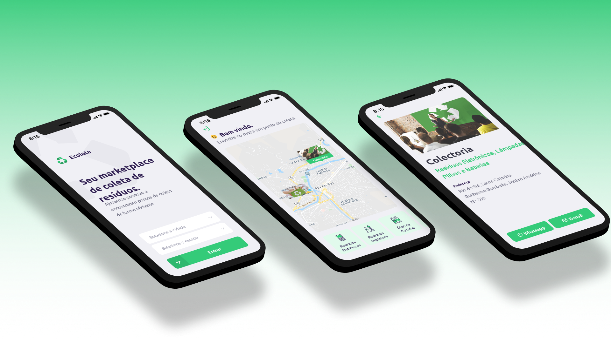
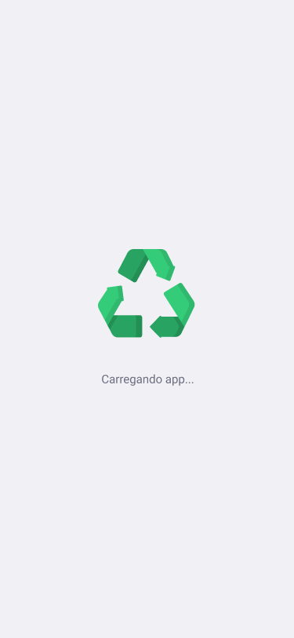
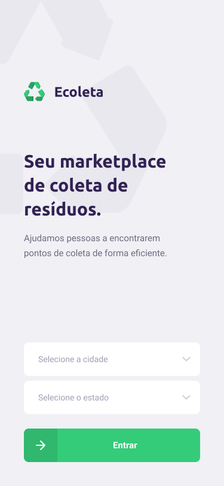
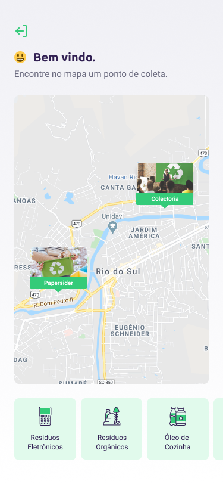
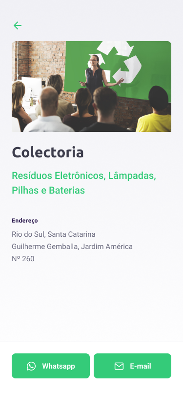

<p align="center">
  
</p>

<h2 align="center">Recicle e ajude o meio ambiente</h2>

<p align="center">
  <a href="https://rocketseat.com.br">
    
  </a>
  
</p>

## Projeto realizado na Next Level Week #1

### Tecnologias usadas

- [React native - Expo]() :
  - [Expo Location]()
  - [Expo font]()
  - [Expo mail composer]()
  - [Typescript](https://www.typescriptlang.org/)
  - [Axios](https://github.com/axios/axios)
  - [React native maps](https://github.com/react-native-community/react-native-maps)
  - [React navigation](https://reactnavigation.org/)

## Faça um clone

```
$ git clone https://github.com/lukatassano/ecoleta-mobile
```

## Execute

```
# Instale as dependencias
$ npm install

# Inicie a aplicação
$ npm start
```

# Resultado

<p align="center" >
  
  
  
  
  
</p>

## Veja também a aplicação <a href="https://github.com/lukatassano/ecoleta-backend">Backend</a> e <a href="https://github.com/lukatassano/ecoleta-frontend"> Web </a>
